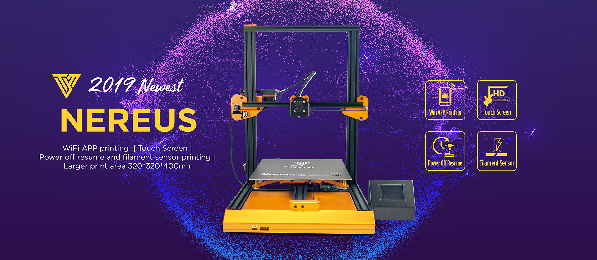

# Tevo Nereus 3D Printer

Welcome to the Github of the TEVO Nereus 3D printer - you find here the latest firmware & documents for your Nereus. Please take time and have detailed look at the infos provided on this page to be sure to update the correct firmware for your motherboard and version of 3d printer.

| Printer                       | Nereus            |
| ----------------------------- |:-----------------:|
| Motherboard version Basic     | Robin Nano        |
| Motherboard version Pro       | MKS Gen L         |
| Firmware                      | Marlin            |
| Actual Version                | T-BW-X.XXXX       |

## Introduction 

## Identify TEVO Nereus Motherboard 

## What version of TEVO Nereus do I have? 

## Important Infos

## Update TEVO Nereus Firmware - Preparation

## Update TEVO Nereus Firmware - Download

## Update TEVO Nereus Firmware - Drivers

## Update TEVO Nereus Firmware - Arduino

## Update TEVO Nereus Firmware - Flash Motherboard

## Testing

## Additional links

- [TEVO Nereus Infos](https://www.tevo.cn/products/3d-printers/tevo-nereus/ "TEVO Nereus Infos")
- [TEVO Nereus FAQ](https://help.tevo.cn/faq-categories/tevo-nereus/ "TEVO Nereus FAQ")

- [TEVO Website](https://www.tevo.cn/ "Visit TEVO Website")
- [TEVO Support](https://help.tevo.cn/ "Visit TEVO Support Suite")

- [TEVO Official Webshop](https://tevo3dprinterstore.com "Visit TEVO Official Webshop")
- [TEVO Aliexpress Shop](https://tevo.aliexpress.com/store/2010004 "Visit TEVO Aliexpress Shop")
- [TEVO Amazon Store](https://www.amazon.com/stores/node/9447801011 " Visit TEVO Amazon Store")

